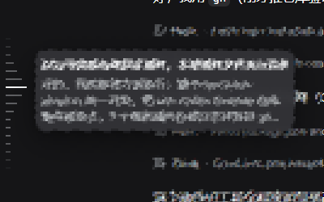

# dsh-message-map

[](https://www.npmjs.com/package/dsh-message-map)
[](https://github.com/ChiYuKe/dsh-message-map)
[](LICENSE)

**为 DeepSeek Harness 移植 Codex 风格的会话消息导航轨道（Message map）。**

> 只使用 DSH 已渲染的会话节点，不修改会话数据，也不执行 Host 命令。

> **注意：会话内用户消息达到 4 条后，按钮与消息轴才会出现**（标记按用户消息计数，不足 4 条时不显示任何内容）。

## 功能

- 会话右上角"消息导航"按钮，聊天区左侧按消息位置绘制纵向刻度
- 悬停刻度显示消息摘要与上下文注入来源
- 点击刻度快速跳转（200ms 缓动动画），目标消息短暂高亮
- 按住拖动刻度可快速扫览消息
- 自动监听消息追加、历史加载、窗口尺寸与滚动变化
- 会话内用户消息达到 **4 条**后自动出现（不足 4 条时不显示）

## 效果预览



## 安装

**方式一：npm（推荐）**

```sh
dsh plugin --profile web add dsh-message-map
```

**方式二：GitHub**

```sh
dsh plugin --profile web add github:ChiYuKe/dsh-message-map
```

锁定版本安装（防止后续推送悄悄改变实际运行的内容）：

```sh
dsh plugin --profile web add github:ChiYuKe/dsh-message-map#v0.1.0
```

仓库已提交构建产物 `lib/`，且没有 `prepare` 脚本——**不需要 allowBuilds 授权**，装完即用。

**方式三：本地开发**

```sh
dsh plugin --profile web add /path/to/dsh-message-map
```

本地安装为 link 方式：修改 `src/` 后需先 `pnpm build` 重建 `lib/`，再刷新页面生效。

## 使用

```sh
dsh --profile web
```

打开任意会话，用户消息达到 4 条后，右上角出现"消息导航"按钮；点击显示/隐藏左侧消息刻度，点击刻度跳转到对应消息。

## 开发与构建

```sh
pnpm install
pnpm build     # tsdown 重新生成 lib/index.js 与 lib/client.js
```

发布前把重新构建的 `lib/` 一起提交进仓库（git 安装直接使用仓库里的构建产物）。

## 发布新版本

```sh
# 1. 更新 package.json 的 version（如 0.1.0 → 0.2.0）
# 2. 构建并提交
pnpm build
git add -A && git commit -m 'release: v0.2.0'
# 3. 发布到 npm（需要 bypass 2FA 的 publish token）
npm publish
# 4. 打 tag 并推送
git tag v0.2.0 && git push origin v0.2.0
```

## 许可证

[MIT](LICENSE)
